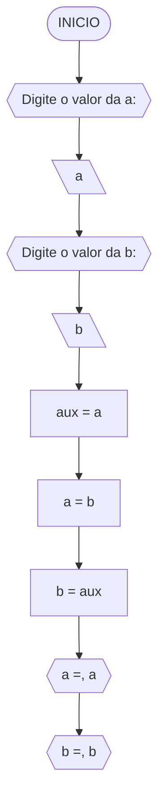
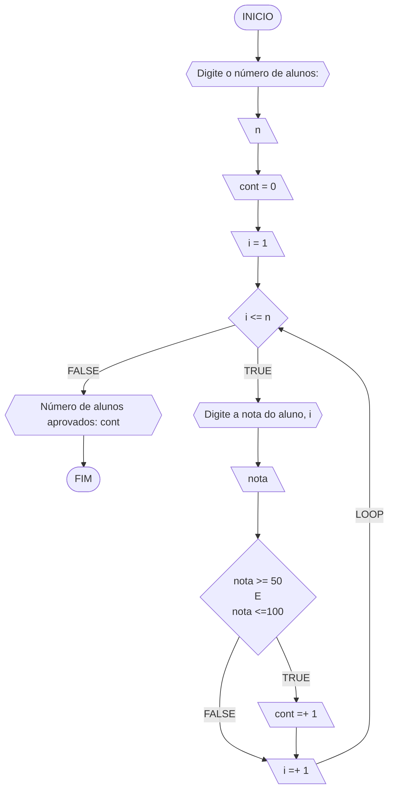
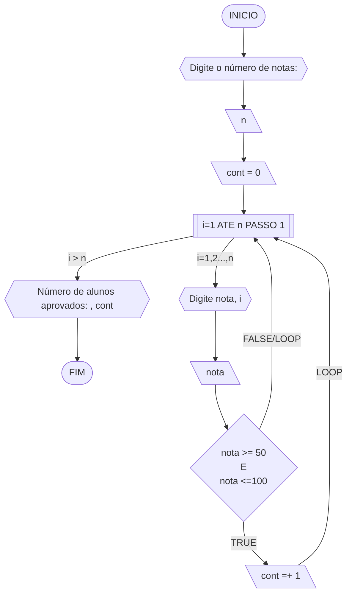
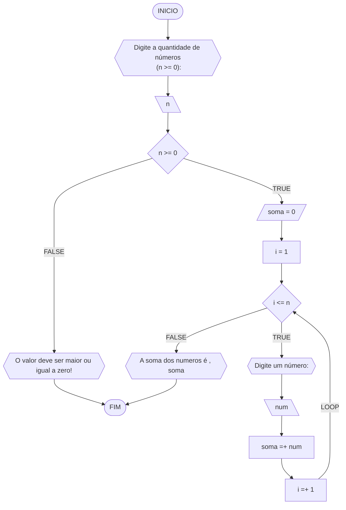
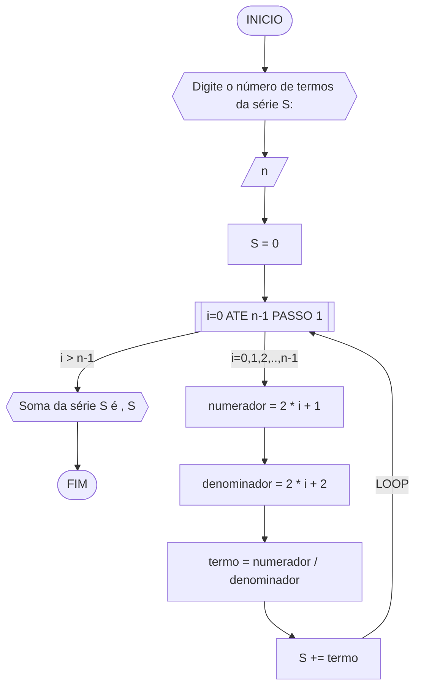
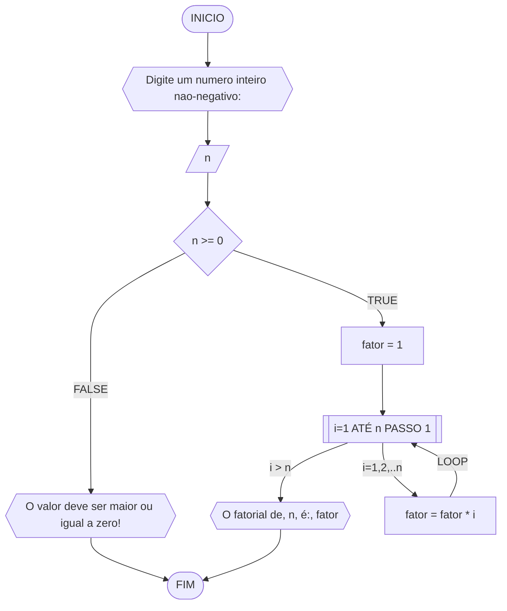
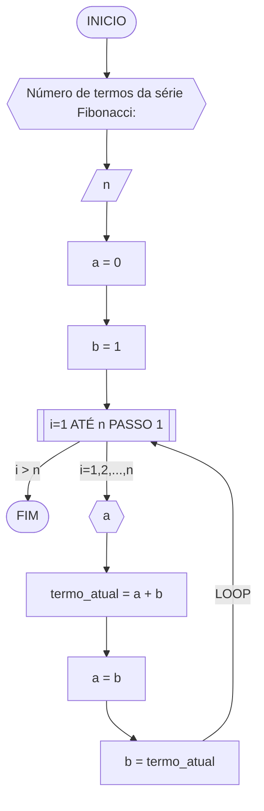
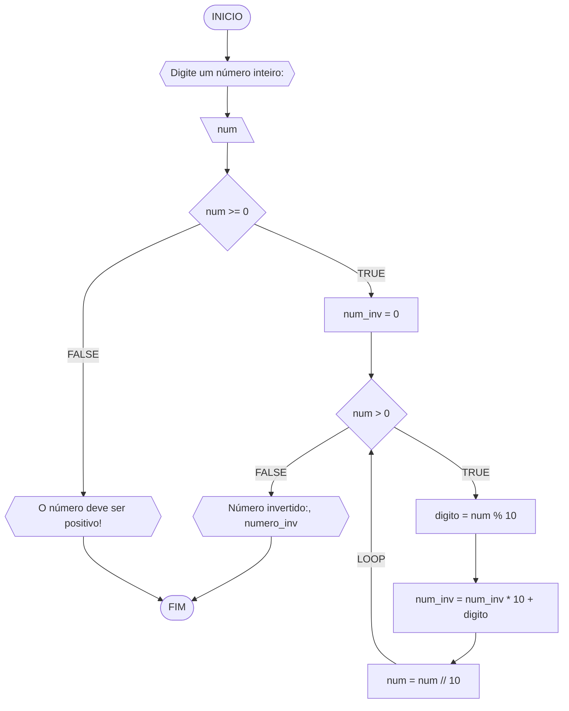

**Curso:** Engenharia Elétrica <br>
**Disciplina:** Raciocínio lógico algorítmico  <br>
**Código/Turma:** T998-21 <br>
**Professor:** Ricardo Carubbi <br>
**Data:** 01/04/2024 <br>
**Aluno(a):** Vyrna Moura Saboia Cavalcante <br>
**Matrícula:** 2210638 <br>

**1a chamada (Sim/Não):** NÃO <br>
**2a chamada (Sim/Não):** SIM

# Avaliação Diagnóstica 1

## Normas e exigências

Avaliação diagnóstica (**AD**) consiste em exercícios ou projetos desenvolvidos em grupo ao longo da disciplina. <br>
A primeira avaliação diagnóstica (**AD1**) será composta por exercícios e equivale a 30% da nota da primeira avaliação (**AV1**).

Segue abaixo a expressão para o cálculo da **AV1**, sendo sendo **AF1** equivale a primeira avaliação formativa e **AD1**, a primeira avaliação diagnóstica.

$$AV_1 = AF_1 \times 0,30 + AD_1 \times 0,70$$

A **AD1** é formada pela entrega dos exercícios (**EX1**) na data prevista e apresentação (**AP1**) de um dos exercícios escolhido pelo professor.
Segue abaixo a expressão para o cálculo da **AD1**.

$$AD_1 = (EX_1 + AP_1)/2 $$

A **EX1** é avaliada mediante a **correção dos exercícios**, sendo a avaliação no intervalo de 0% (não atende a questão), 50% (atende parcialmente) e 100% (atende em sua totalidade).
Por exemplo, se o exercício equivale a 2 pontos e sua correção atente parcialmente a questão, então sua avaliação deste exercício será 1 ponto.

A **AP1** é avaliada mediante aos pré-requisitos de **clareza, organização e domínio do conteúdo**. Portanto, o aluno deve demonstrar um bom entendimento do algoritmo, explicando seus princípios fundamentais, seu propósito e como ele funciona passo a passo. <br>

A avaliação da **AP1** é apenas considerada no intervalo de 0% (não atende os pré-requisitos), 25% (pouco atende os pré-requisitos), 50% (atende de forma mediana os pré-requisitos), 75% (atende de forma razoável os pré-requisitos) e 100% (atende em a totalidade dos pré-requisitos).
Por exemplo, se na apresentação do exercício, o aluno atenter de forma razoável a questão, então sua avaliação da apresentação será 7.5 pontos.

## Datas
- Entrega da primeira avaliação formativa (**AF1**) composta pelas listas de exerciícios 1, 2 e 3: 21/03/24 e 22/03/24 apenas para T998 - 08/09.
- Entrega dos exercícios da primeira avaliação diagnóstica (**EX1**): 21/03/24 e 22/03/24 apenas para T998 - 08/09.
- Apresentação da primeira avaliação diagnóstica (**AP1**): 21/03/24 e 22/03/24 apenas para T998 - 08/09.

## Observações
- Não serão admitidas alterações dos exercícios após a entrega do(s) trabalho(s) sob penalização com a anulação dos mesmos.

## Lista de questões

### Questão 1 - Troca dos valores de duas variáveis (1 ponto)

Dadas duas variáveis, $a$ e $b$, implemente e teste um algoritmo para trocar os valores atribuídos a elas.

#### Descrição geral do algoritmo

1. Guardar o valor original da variável $a$ em uma variável auxiliar $aux$;
2. Atribuir à variável $a$ o valor original da variável $b$;
3. Atribuir à variável $b$ o valor original da variável $a$, que está armazenado na variável auxiliar $aux$.
4. Exibir os novos valores de $a$ e $b$.

#### Fluxograma



#### Pseudocódigo (1 ponto)

```java
ALGORTIMO TrocaValores
DECLARE a,b,axu: REAL

INICIO

    // Entrada do usuário para o número real da variável "a"
    ESCREVA "Digite o valor da a:"

    // Armazena o valor de entrada na variável "a"
    LEIA a

    // Entrada do usuário para o número real da variável "b"
    ESCREVA "Digite o valor da b:"

    // Armazena o valor de entrada na variável "b"
    LEIA b

    // Atribui o valor de "a" em "aux"
    aux <- a 

    // Atribui o valor de "b" a "a"
    a <- b

    // Atribui o valor de "aux", que é o valor original de "a", a "b"
    b <- aux

    // Exibe a mensagem com os novos valores trocados
    ESCREVA "a=", a
    ESCREVA "b=", b

FIM
```

#### Tabela de testes

| a  | b  | aux | a  | b  | saída 1 | saída 2 | 
| -- | -- | --  | -- | -- | --      | --      | 
| 0  | 1  | 0   | 1  | 0  | a = 1   | b = 0   |

### Questão 2 - Contagem (1 ponto)

Dado um conjunto $n$ de notas de alunos em um exame, implemente e teste um algoritmo para fazer uma contagem $cont$ do número de alunos que foram aprovados no exame. 
Será considerado aprovado o aluno que tirar $nota$ 50 ou maior (no intervalo de 0 a 100).

#### Descrição geral do algoritmo

1. Obter o número de notas $n$ a serem processadas;
2. Inicializar a contagem $cont$ com zero;
3. Enquanto houver notas a serem processadas, fazer repetidamente:
    - obter a próxima nota;
    - se a nota for suficiente para passar no exame ($n ≥ 50$) então adicionar 1 (um) à contagem $cont$;
4. Exibir a contagem $cont$ (número total de aprovações).

#### Fluxograma 01
Fluxograma conforme descrição do algoritmo acima, usando o loop ENQUANTO.



#### Fluxograma 02
Fluxograma opcional usando o loop PARA.



#### Pseudocódigo 01 (1 ponto)

```java
ALGORTIMO ContaAprovacoes
DECLARE n, cont, nota, i: INTEIRO

INICIO

    // Entrada do usuário para a quantidade de notas
    ESCREVA "Digite a quantidade de notas dos alunos:"

    // Armazena o valor de entrada na variável "n"
    LEIA n

    // Inicializa o contador de alunos aprovados
    cont = 0 

    // Loop contado (loop for) executa as instruções a cada iteração dos valores de 'i' de 1 até n, incrementando 'i' em 1.
    PARA i DE 1 ATE n FAÇA

        // Solicita ao usuário que insira a nota do aluno
        ESCREVA "Digite a nota do aluno", i, ":"

        // Armazena a nota do aluno na variável "nota"
        LEIA nota

        // Executa e verifica se a nota está entre 50 e 100
        SE nota >= 50 E nota <= 100 ENTAO

            // Incrementa o contador de alunos aprovados somando 1
            cont = cont + 1 

        FIM_SE

    FIM_PARA

    // Exibe a mensagem informando a quantidade de alunos aprovados 
    ESCREVA "O numero de alunos aprovados é:", cont

FIM
```

#### Tabela de testes 01
Tabela de testes referente ao algoritmo usando o loop ENQUANTO.

| it | n  | i  | cont | i<=n  | nota, i | nota | nota_valida | cont+1 | i+1 | saída        | 
| -- | -- | -- | --   | --    | --      | --   | --          | --     | --  | --           |
| 1  | 3  | 1  |  0   | True  | nota 1  | 60   | True        | 1      | 2   |              |
| 2  | 3  | 2  |  1   | True  | nota 2  | 40   | False       | 1      | 3   |              |
| 3  | 3  | 3  |  1   | True  | nota 3  | 90   | True        | 2      | 4   |              |
| 4  | 3  | 4  |  2   | False |         |      |             |        |     | Aprovados: 2 |

#### Tabela de testes 02
Tabela de testes referente ao algoritmo usando o loop PARA.

| it | n  | cont | i  | nota, i | nota | nota_valida | cont+1 | saída        | 
| -- | -- | --   | -- | --      | --   | --          | --     | --           |
| 1  | 3  | 0    | 1  | nota 1  | 60   | True        | 1      |              |
| 2  | 3  | 1    | 2  | nota 2  | 40   | False       | 1      |              |
| 3  | 3  | 1    | 3  | nota 3  | 90   | True        | 2      | Aprovados: 2 |

### Questão 3 - Soma de um conjunto de números (1 ponto)

Dado um conjunto de $n$ números, implemente e teste um algoritmo para calcular a soma desses números. <br>
Aceite apenas $n$ maior ou igual a zero.

#### Descrição geral do algoritmo

1. Obter a quantidade de números $n$ a serem somados.
2. Inicializar a variável $soma$ com 0 (zero).
3. Enquanto menos do que $n$ números tiverem sido somados, fazer repetidamente:
    - obter o próximo número $i$;
    - calcular a soma atual, adicionando o número $i$ obtido à soma mais recente;
4. Exibir a soma dos $n$ números

#### Fluxograma



#### Pseudocódigo (1 ponto)

```java
Algoritmo SomaNumeros
DECLARE n,i,soma: INTEIRO

INICIO

    // Entrada do usuário para a quantidade de números
    ESCREVA "Digite a quantidade de números<br> (n >= 0):"
    // Armazena o valor de entrada na variável "n"
    LEIA n

    // Verifica se o valor de n é maior ou igual a zero
    SE n >=0 ENTAO

        // Inicializa a variável de "soma" em 0
        soma <- 0

        // Inicializa o contador "i" em 1
        i <- 1

        // Loop condicional (loop while) executa as instruções enquanto a condição "i <= n" for verdadeira
        ENQUANTO i <= n FAÇA

            // Solicita ao usuário que digite um número
            ESCREVA "Digite um número:"

            // Armazena o valor de entrada na variável "num"
            LEIA num 

            // Adiciona o "num" à "soma" atual
            soma <- soma + num

            // Incrementa o contador somando 1 à "i"
            i <- i + 1

        FIM_ENQUANTO

    // Exibe a mensagem caso o valor de n seja menor que zero
    SENAO
        ESCREVA "O valor deve ser maior ou igual a zero!"

    FIM_SE

    // Exibe a mensagem informando a soma dos números
    ESCREVA "A soma dos numeros é , soma"

FIM
```

#### Tabela de testes

| it | n  | n >= 0 | soma | i  | i <= n | num | soma =+ num  | saída                   |
| -- | -- | --     | --   | -- | --     | --  | --           | --                      |
|    | -3 | False  |      |    |        |     |              | O valor deve ser ...    |
| 1  | 0  | True   | 0    | 1  | False  |     |              | A soma dos números é 0  |
| 1  | 3  | True   | 0    | 1  | True   | 5   | 0 + 5 = 5    |                         |
| 2  | 3  | True   | 5    | 2  | True   | 10  | 5 + 10 = 15  |                         |
| 3  | 3  | True   | 15   | 3  | True   | 20  | 15 + 20 = 35 |                         |
| 4  | 3  | True   | 35   | 4  | False  |     |              | A soma dos números é 35 |

### Questão 4 - Cálculo de uma série (1 ponto)

Dado um conjunto de $n$ termos da série, implemente e teste um algoritmo para calcular o valor de S, conforme definido abaixo:

$$ S = \frac{1}{2} + \frac{3}{4} + \frac{5}{6} + \frac{7}{8} + \dots $$

#### Descrição geral do algoritmo

1. Obter o número de termos $n$;
2. Inicializar a variável $S$ com 0 (zero).
3. Iterar o valor de $n$ na variável $i$ iniciando com 0 (zero), de acordo com as instruções abaixo:
    - calcular o numerador na variável $numerador$;
    - calcular o denominador  na variável $denominador$;;
    - calcular o termo da série na variável $termo$, onde $termo = numerador/denominador$;
    - adicionar esse termo à variável $S$.
4. Exibir o valor da série $S$.

#### Fluxograma



#### Pseudocódigo (1 ponto)

```java
Algoritmo SomaSerie
DECLARE n,numerador,denominador: INTEIRO; termo, S: REAL

INICIO

    // Solicita ao usuário que digite o número de termos da série S
    ESCREVA "Digite o número de termos da série S:"

    // Armazena o valor digitado pelo usuário e armazena em "n"
    LEIA n

    // Inicializa a variável S, soma da série, como zero
    S <- 0

    // Loop contado (loop for) executa as instruções a cada iteração dos valores de 'i' de 0 até n-1, incrementando 'i' em 1.
    PARA i de 0 ATÉ n-1 PASSO 1 FAÇA

        // Calcula o numerador do termo atual da série multiplicando por 2 o "i" e somando à 1
        numerador = 2 * i + 1

        // Calcula o denominador do termo atual da série multiplicando por 2 o "i" e somando à 2
        denominador <- 2 * i + 2

        // Calcula o termo atual da série dividindo o numerador e o denominador 
        termo = numerador / denominador

        // Calcula a soma o termo atual à variável S
        S <- S + termo

    FIM_PARA

    // Exibe a mensagem informando a soma da sperie S
    ESCREVA "Soma da série S é ", S

FIM
```

#### Tabela de testes (0.25 ponto)

| it | n  | S  | i | numerador | denominador | termo | S += termo     | saída                  |
| -- | -- | -- |-- | --        | --          | --    | --             | --                     |
|    | 0  | 0  |   |           |             |       |                |                        |
| 1  | 4  | 0  | 0 | 2*0+1 = 1 | 2*0+2 = 2   | 1/2   | 0+1/2 = 1/2    |                        |
| 2  | 4  | 0  | 1 | 2*1+1 = 1 | 2*1+2 = 2   | 3/4   | 1/2+3/4 = 1.25 |                        |
| 3  | 4  | 0  | 2 | 2*2+1 = 1 | 2*2+2 = 2   | 5/6   | 0+1/2 = 2.08   |                        |
| 4  | 4  | 0  | 3 | 2*3+1 = 1 | 2*3+2 = 2   | 7/8   | 0+1/2 = 2.96   | Soma da série S é 2.96 |

### Questão 5 - Cálculo fatorial (2 pontos)

Dado um número $n$, implemente e teste um algoritmo para calcular o fatorial de $n$ (escrito como $n!$), onde $n ≥ 0$.

#### Descrição geral do algoritmo

1. Obter o número $n$, onde $n \geq 0$;
2. Inicializar a variável $fator$ com 1 (um) para armazenar o resultado do cálculo do fatorial;
3. Iterar o valor de $n$ na variável $i$, ou seja, executar $n$ vezes, as instruções abaixo:
    - Incrementar o valor atual $fator$ multiplicando pelo valor de $i$;
4. Exibir o resultado ($n!$).

#### Fluxograma



#### Pseudocódigo (2 pontos)

```java
ALGORITMO CalcFatorial
DECLARE n: INTEIRO

INICIO

    // Solicita ao usuário que digite o número inteiro não negativo
    ESCREVA "Digite um numero inteiro nao-negativo:"

    // Armazena o valor de entrada na variável "n"
    LEIA n

    // Executa a instrução para verificar se "n" não é negativo
    SE n >= 0 ENTAO

        // Inicializa o fatorial como 1
        fator <- 1

        // Loop contado (loop for) executa as instruções a cada iteração dos valores de 'i' de 0 até n, incrementando 'i' em 1.
        PARA i DE 1 ATÉ n PASSO 1 FAÇA

            // Multiplica o fatorial pelo valor atual de i
            fator <- fator * i        // fator *= i

        FIM_PARA

        // Exibe uma mensagem informando o fatorial calculado
        ESCREVA "O fatorial de, n, é:", fator

    // Exibe uma mensagem de erro se o número for negativo
    SENAO
        ESCREVA "O valor deve ser maior ou igual a zero!"
    FIM_SE

FIM
```

#### Tabela de testes

| n  | fator | i  | fator = fator * i | saída               |
| -- | --    | -- | --                | --                  |
| 3  | 1     | 1  | 1*1 = 1           |                     |
| 3  | 1     | 2  | 1*2 = 2           |                     |
| 3  | 2     | 3  | 2*3 = 6           | O fatorial de 3 é 6 |

### Questão 6 - Geração da sequência de Fibonacci (2 pontos)

Gerar e imprimir os $n$ primeiros termos da sequência de Fibonacci, onde $n ≥ 1$. <br>
Os primeiros termos são: $0, 1, 1, 2, 3, 5, 8, 13, \dots$. Cada termo, além dos dois primeiros, é derivado da soma dos seus dois antecessores mais próximos.

#### Descrição geral do algoritmo

1. Obter o número de termos $n$, onde $n \geq 1$;
2. Inicializar os dois primeiros termos da série nas variável $a$ e $b$ com 0 (zero);
3. Iterar o valor de $n$, ou seja, executar $n$ vezes, as instruções abaixo:
    - Imprimir o termo inicial $a$ (instrução para exibir a sequência ao atualizar a variável $a$);
    - Somar os termos $a$ e $b$ na variável $termo_atual$;
    - Atribuir a variável $a$ o valor da variável $b$;
    - Atribuir a variável $b$ o valor da variável $termo_atual$.

#### Fluxograma



#### Pseudocódigo (2 pontos)

```java
ALGORITMO GeraFibonacci
DECLARE n, a, b, termo_atual: INTEIRO

INICIO

    // Entrada do usuário para o números de termos 
    ESCREVA "Número de termos da série Fibonacci:"

    // Armazena o valor digitado pelo usuário e armazena em "n"
    LEIA n

    // Inicializa o primeiro termo da série Fibonacci
    a <- 0

    // Inicializa o segundo termo da série Fibonacci
    b <- 1

    // Loop de contagem (loop for) para gerar os termos da série Fibonacci executando as instruções a cada iteração dos valores de 'i' de 0 até n, incrementando 'i' em 1.
    PARA i DE 1 ATE n FAÇA

        // Exibe uma mensagem com o termo atual da série Fibonacci
        ESCREVA a

        // Calcula o próximo termo da série Fibonacci somando os dois primeiros termos da série Fibonacci
        termo_atual <- a + b

        // Atualiza o valor de "a" para "b" para os próximos cálculos
        a <- b

        // Atualiza os valores de "b" para "termo_atual" para os próximos cálculos
        b <- termo_atual

    FIM_PARA
FIM

```
#### Tabela de testes

| it | n  | a  | b  | i  | saída | termo_atual = a + b | a = b | b = termo_atual |
| -- | -- | -- | -- | -- | --    | --                  | --    | --              |
| 1  | 5  | 0  | 1  | 1  | 0     | 0 + 1 = 1           | 1     | 1               |
| 2  | 5  | 1  | 1  | 2  | 1     | 1 + 1 = 2           | 1     | 2               |
| 3  | 5  | 1  | 2  | 3  | 1     | 1 + 2 = 3           | 2     | 3               |
| 4  | 5  | 2  | 3  | 4  | 2     | 2 + 3 = 5           | 3     | 5               |
| 4  | 5  | 3  | 5  | 5  | 3     | 3 + 5 = 8           | 5     | 8               |

### Questão 7 - Inversão dos dígitos de um número inteiro (2 pontos)

Implemente e teste um algoritmo para inverter a ordem dos dígitos de um número inteiro positivo.

#### Descrição geral do algoritmo

1. Obter o número inteiro positivo $num$ a ser invertido;
2. Inicializar a variável $num \textunderscore inv$ com 0 (zero);
3. Enquanto o número for maior que zero ($num > 0$), faça repetidamente:
    - Calcular o último dígito do número na variável $digito$;
    - Adicionar o dígito ao número invertido $num \textunderscore inv$;
    - Remover o último dígito do número original $num$; 
4. Exibir o número invertido.

#### Fluxograma



#### Pseudocódigo (2 pontos)

```java
Algoritmo InverteInteiro
DECLARE num, num_inv, digito: INTEIRO

INICIO

    // Entrada do usuário de um número inteiro qualquer armezando na variável "num"
    ESCREVA "Digite o número a ser invertido:"
    LEIA num

    // Executa a instrução para verificar se "n" é positivo
    SE num < 0 ENTAO

        // Exibe uma mensagem de erro caso o número seja negativo
        ESCREVA "O número deve ser positivo!"

    // Caso contário continua
    SENAO

        // Inicializa a variável para armazenar o número invertido
        num_inv <- 0

        // Loop condicional para inverter o número enquanto houver dígitos
        ENQUANTO num > 0 FAÇA

            // Calcula o dígito da divisão de "num" por 10
            digito <- num % 10

            // Adiciona o dígito invertido ao número invertido
            num_inv <- (num_inv * 10) + digito

            // Remove o último dígito do número original dividindo "num" por 10
            num <- num // 10

        // Exibe uma mensagem com o número invertido
        ESCREVA "Número invertido:", num_inv

    FIM_SE

FIM
```

#### Tabela de testes

| it | num | num_inv | num > 0 | digito | num = num // 10 | num_inv = (num_inv * 10) + digito | Saída                        |
| -- | --  | --      | --     | --      | --              | --                                | --                           |
|    | -1  | 0       | False  |         |                 |                                   | O número deve ser positivo!  |
| 1  | 0   | 0       | False  |         |                 |                                   | Número invertido:: 0         |
| 1  | 42  | 0       | True   | 2       | 4               | 2                                 |                              |
| 2  | 4   | 2       | True   | 4       | 0               | 24                                |                              |
| 3  | 0   | 24      | False  |         |                 |                                   | Número invertido:: 24        |
