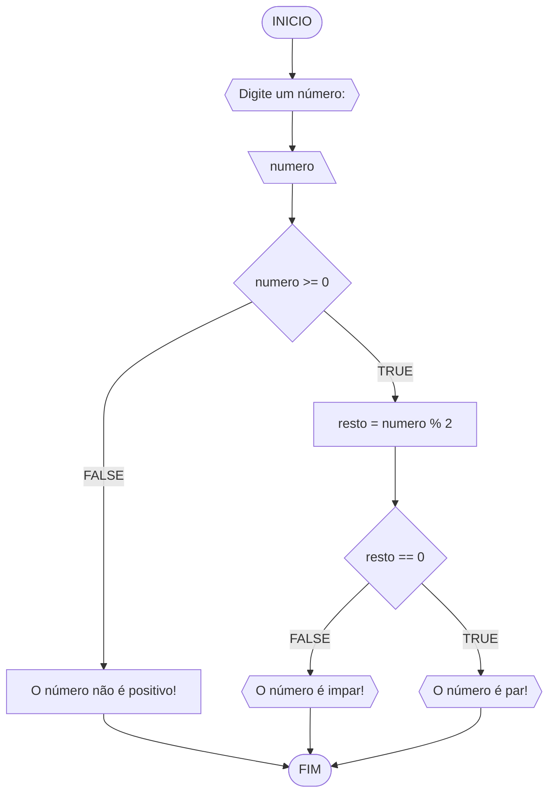
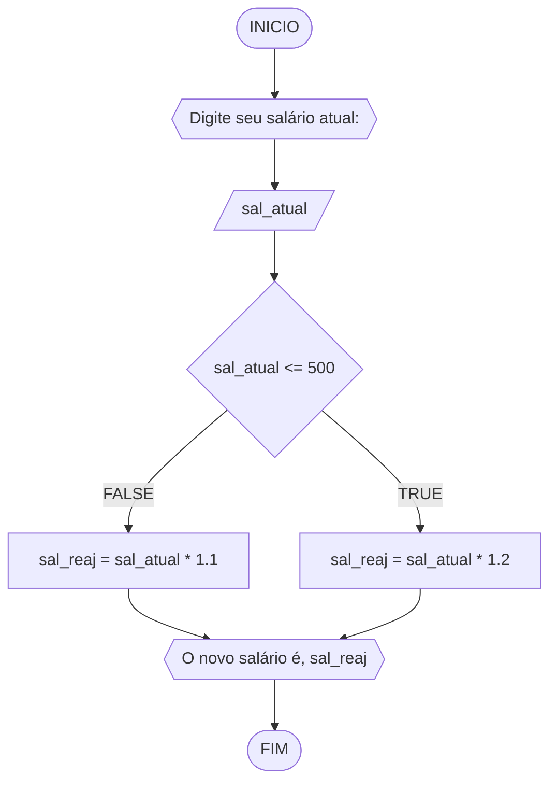
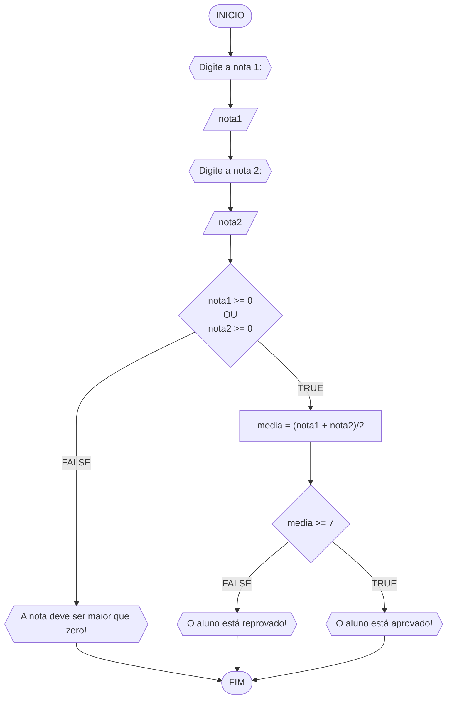
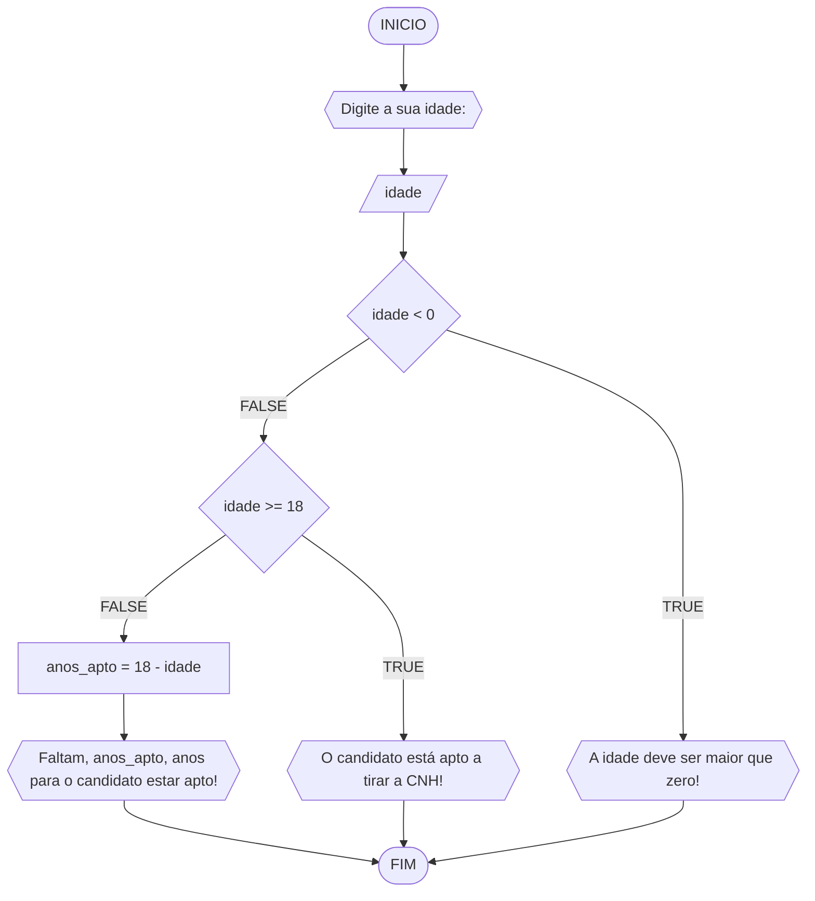

# UNIFOR
**Nome**: Vyrna Moura Saboia Cavalcante <br>
**Disciplina**: Raciocínio lógico algorítmico

## Lista de exercícios 01

### Exercício 01 (1 ponto)
Represente, em fluxograma e pseudocódigo, um algoritmo para determinar se um número inteiro e positivo é par ou impar.

#### Fluxograma (0,25 ponto)



#### Pseudocódigo
```java
ALGORTIMO verifica_par_impar
DECLARE numero, resto: INTEIRO

INICIO

    // Exibe a mensagem para entrada de dados
    ESCREVA "Digite um número: "
    
    // Armazena a entrada do usuário na variável "numero"
    LEIA numero
    
    // Executa as instruções sob a condição "numero >= 0" for verdadeira
    SE numero >= 0 ENTAO

        // Calcula o resto da divisão de "num" por 2
        resto <- numero % 2

        // Executa a instrução se o resto é igual a zero
        SE resto == 0 ENTAO
            ESCREVA "O número é par!"

        // Executa a instrução se o resto não for igual a zero
        SENAO
          ESCREVA "O número é impar!"

        FIM_SE

    // Executa a instrução se inteiro for negativo
    SENAO             
        ESCREVA "O número deve ser postivo!"

    FIM_SE

FIM
```

#### Tabela de testes (0,25 ponto)
| numero | numero >= 0 | resto | resto == 0 | Saída |
| -- | -- | -- | -- | -- | 
| -1 | F |   |   | "O número deve ser postivo!" |
| 0  | V | 0 | V | "O número é par!" |
| 13 | V | 1 | F | "O número é impar!" |
| 30 | V | 0 | V | "O número é par!" |

## Exercício 02 (3 pontos)
Represente, em fluxograma e pseudocódigo, um algoritmo para calcular o novo salário de um funcionário. 
Sabe-se que os funcionários que recebem atualmente salário de até R$ 500 terão aumento de 20%; os demais terão aumento de 10%.

#### Fluxograma (1.0 ponto)



#### Pseudocódigo (1.0 ponto)

```java
ALGORTIMO ReajusteSalario
DECLARE sal_atual, sal_reaj: REAL

INICIO

    // Entrada do usuário de um número real qualquer armezando na variável "sal_atual"
    ESCREVA "Digite seu salário atual:"

    // Armazena o valor de entrada na variável "sal_atual"
    LEIA sal_atual

    // Executa as instruções sob a condição "sal_atual <= 500" for verdadeira
    SE sal_atual <= 500 ENTAO
        sal_reaj = sal_atual * 1.2

    // Executa a instrução se a condição "sal_atual <= 500" for falsa
    SENAO
        sal_reaj = sal_atual * 1.1

    FIM_SE

    // Exibe a mensagem com o número do novo salário
    ESCREVA "O novo salário é R$", sal_reaj

FIM
```

#### Tabela de testes (1.0 ponto)

| sal_atual | sal_atual >= 500 |sal_reaj       | saída                   | 
| --        | --               | --            | --                      | 
| 400       | False            | 400*1.2 = 480 | O novo salário é R$ 480 |
| 500       | True             | 500*1.2 = 600 | O novo salário é R$ 600 |
| 600       | True             | 600*1.1 = 660 | O novo salário é R$ 660 |

## Exercício 03 (3 pontos)
Represente, em fluxograma e pseudocódigo, um algoritmo para calcular a média aritmética entre duas notas de um aluno e mostrar sua situação, que pode ser aprovado ou reprovado.

#### Fluxograma (1 ponto)



#### Pseudocódigo (1 ponto)

```java
ALGORTIMO SituacaoAluno
DECLARE nota1, nota2, media: REAL

INICIO

    // Entrada do usuário de um número real qualquer armezando na variável "nota1"
    ESCREVA "Digite a nota 1:"

    // Armazena o valor de entrada na variável "nota1"
    LEIA nota1

    // Entrada do usuário de um número real qualquer armezando na variável "nota2"
    ESCREVA "Digite a nota 2:"

    // Armazena o valor de entrada na variável "nota2"
    LEIA nota2

    // Executa as instruções sob a condição "nota1 >= 0 E nota2 >= 0" for verdadeira
    SE nota1 >= 0 E nota2 >= 0 ENTAO

        // Calcula o valor da media somando a nota1 e nota2 e dividindo por 2
        media =  (nota1 + nota2)/2

        // Executa as instruções sob a condição "media >= 7" for verdadeira
        SE media >= 7 ENTAO
            ESCREVA "O aluno está aprovado!"

        // Executa a instrução se a media for menor que 7
        SENAO
            ESCREVA "O aluno está reprovado!"

        FIM_SE

    // Executa a instrução se real for negativo
    SENAO
        ESCREVA "A nota deve ser maior que zero!"

    FIM_SE

FIM
```

#### Tabela de testes (1 ponto)

| nota1 | nota2 | nota1 >= 0 E nota2 >= 0 | media        | saĩda | 
| --    | --    | --                      | --           | --    | 
| -1    | 0     | False                   |              | A nota deve ser maior que zero! | 
| 0     | 0     | True                    | (0+0)/2 = 0  | O aluno está reprovado!|
| 4     | 8     | True                    | (4+8)/2 = 6  | O aluno está reprovado!|
| 4     | 10    | True                    | (4+10)/2 = 7 | O aluno está aprovado!|

## Exercício 04 (3 pontos)
Represente, em fluxograma e pseudocódigo, um algoritmo que, a partir da idade do candidato(a), determinar se pode ou não tirar a CNH. 
Caso não atender a restrição de idade, calcular quantos anos faltam para o candidato estar apto.

#### Fluxograma (1.0 ponto)



#### Pseudocódigo (1.0 ponto)

```java
ALGORTIMO AptoCNH
DECLARE idade, anos_apto: INTEIRO

INICIO

    // Entrada do usuário para a idade
    ESCREVA ""Digite a sua idade:"

    // Armazena o valor de entrada na variável "idade"
    LEIA idade

    // Executa as instruções sob a condição "idade < 0" for verdadeira
    SE idade < 0 ENTAO
        ESCREVA "A idade deve ser maior que zero!"

    // Executa caso seja falso
    SENAO

        // Executa as instruçôes para saber se o candidato está apto a tirar a CNH
        SE idade >= 18 ENTAO
            ESCREVA "O candidato está apto a tirar a CNH!"

        // Executa caso candidato não esteja apto
        SENAO

            // Calcula "anos_aptos" subtraindo o número 18 pela "idade"
            anos_apto <- 18 - idade

            // Exibe a mensagem com o número de anos que faltam para o candidato estar apto
            ESCREVA "Faltam", anos_apto, "ano(s) para o candidato estar apto!"

        FIM_SE

    FIM_SE

FIM
```

#### Tabela de testes (1.0 ponto)

| idade | idade < 0 | idade >= 18 | anos_apto | saída                                         | 
| --    | --        | --          | --        | --                                            | 
| -1    | True      |             |           |                                               |
| 0     | False     | False       | 18-0 = 18 | Faltam 18 ano(s) para o candidato estar apto! |
| 17    | False     | False       | 18-17 = 1 | Faltam 1 ano(s) para o candidato estar apto!  |
| 18    | False     | True        |           | O candidato está apto a tirar a CNH!          |
