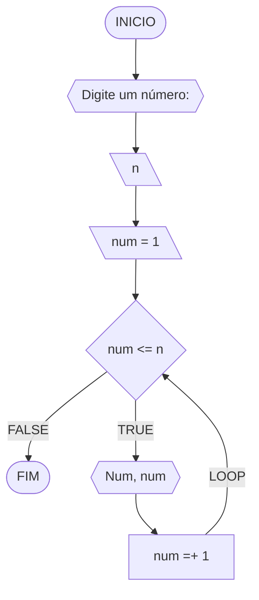
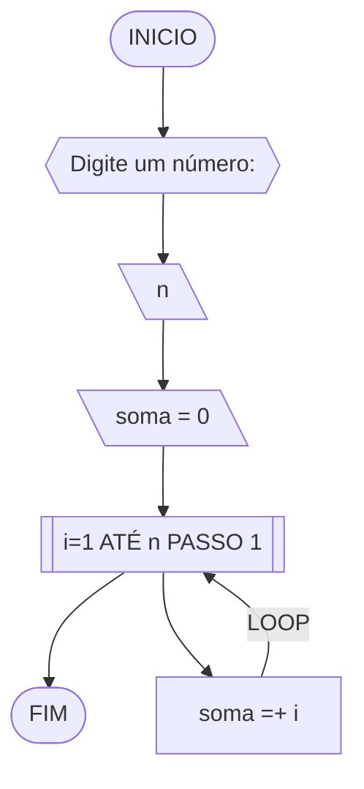
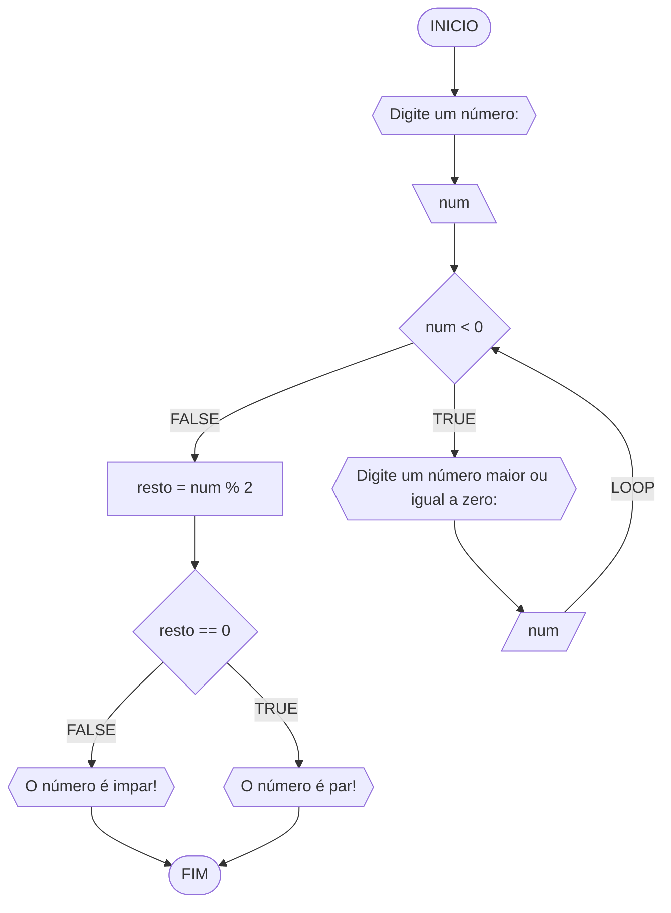
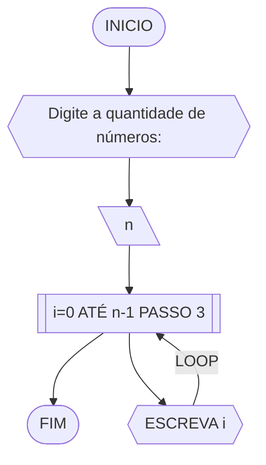
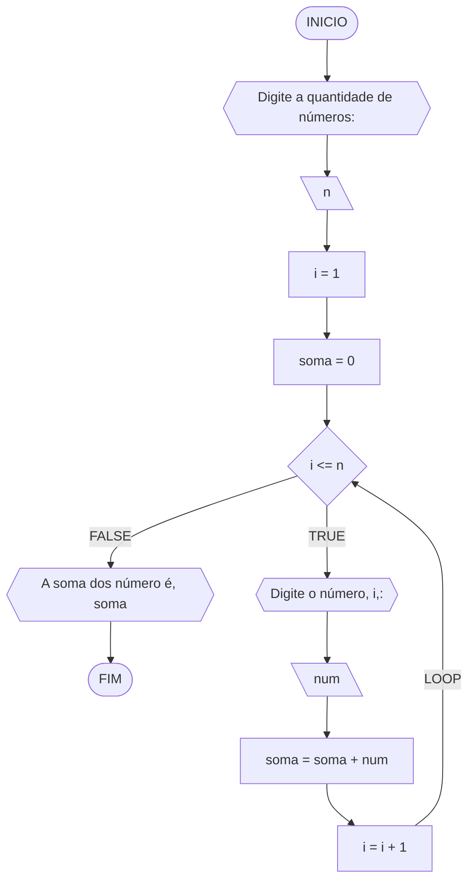
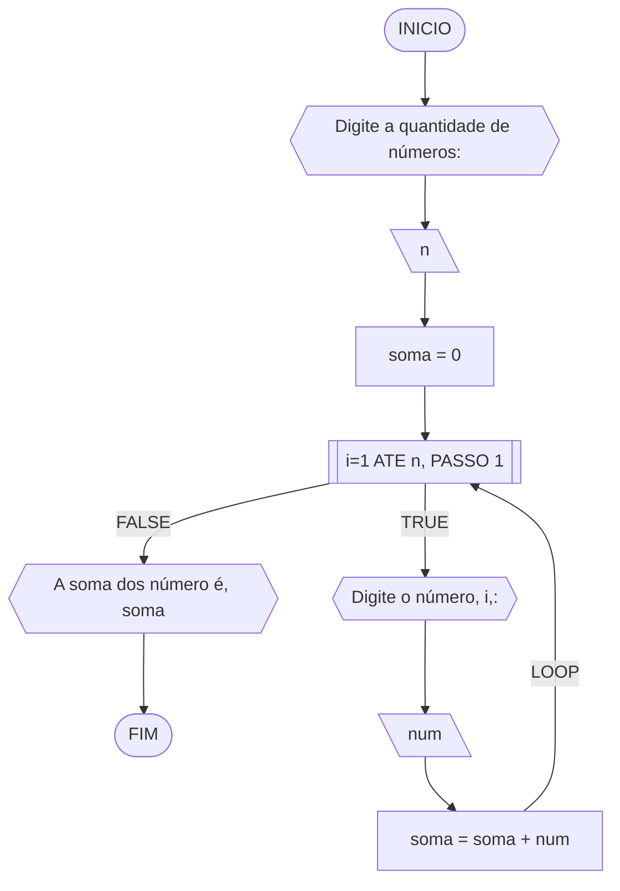
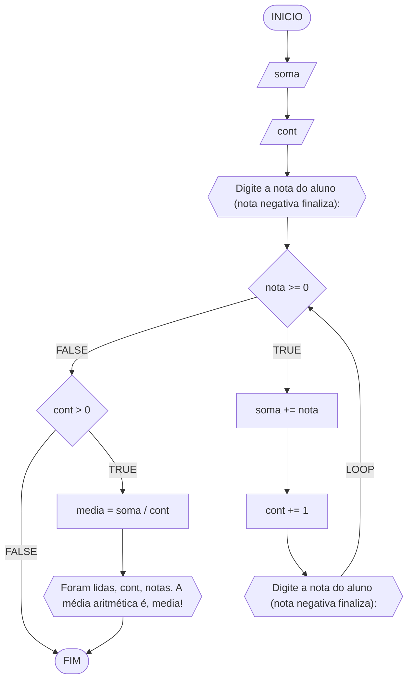

# UNIFOR
**Nome**: Nome do estudante<br>
**Disciplina**: Raciocínio lógico algorítmico

## Exercício exemplo 1
Implemente e teste um programa que imprima os n primeiros números.

#### Fluxograma


#### Pseudocódigo
```java
ALGORITMO print_n_primeiros
DECLARE n, num: INTEIRO

INICIO

	// Variável n como dado de entrada
	ESCREVA “Digite um número: ”
	LEIA n

	// Variável num inicializada com valor de 1
	num ← 1

	// Loop condicional (loop while) que executa as instruções enquanto a condição "num <= n" for verdadeira
	ENQUANTO num <= n FAÇA

		// Exibe a mensagem no número em questão
		ESCREVA “Número ”, num

		// Incrementa a variável "num" em 1
		num ← num + 1

	FIM_ENQUANTO

FIM
```

#### Tabela de testes
| it | n  | num | num <= n | Saída      | num =+ 1 |
| -- | -- | --  | --       | --         | --       |
| 1  | 10 | 1   | True     | Número 1   | 2        |
| 2  | 10 | 2   | True     | Número 2   | 3        |
| 3  | 10 | 3   | True     | Número 3   | 4        |
| 4  | 10 | 4   | True     | Número 4   | 5        |
| 5  | 10 | 5   | True     | Número 5   | 6        |
| 6  | 10 | 6   | True     | Número 6   | 7        |
| 7  | 10 | 7   | True     | Número 7   | 8        |
| 8  | 10 | 8   | True     | Número 8   | 9        |
| 9  | 10 | 9   | True     | Número 9   | 10       |
| 10 | 10 | 11  | True     | Número 10  | 11       |
| 11 | 10 | 11  | False    |            |          |

## Exercício exemplo 2
Implemente e teste um programa que some os n primeiros números.

#### Fluxograma


#### Pseudocódigo
```java
ALGORITMO	soma_n_numeros()
DECLARE	n, i, soma: INTEIRO

INICIO

	// Exibe a mensagem para entrada de dados
	ESCREVA “Digite a quantidade de números: ”

	// Armazena a entrada do usuário na variável "n"
	LEIA n

	// Variável soma inicializada com valor de 0
	soma ← 0 

	// Loop contado (loop for) executa as instruções a cada iteração dos valores de 'i' de 1 até n, incrementando 'i' em 1.
	PARA i DE 1 ATÉ n PASSO 1 FAÇA

		// Incrementa a soma conforme cada iteração da variável "i"
		soma ← soma + i

	FIM_PARA

	// Exibe a mensagem como saída de dados
	ESCREVA “A soma é igual a ”, soma

FIM
```

#### Tabela de testes
| it | n  | soma | i  | soma =+ i |
| -- | -- | --   | -- | --        |
| 1  | 10 | 0    | 1  | 1         |
| 2  | 10 | 1    | 2  | 3         |
| 3  | 10 | 3    | 3  | 6         |
| 4  | 10 | 6    | 4  | 10        |
| 5  | 10 | 10   | 5  | 15        |
| 6  | 10 | 15   | 6  | 21        |
| 7  | 10 | 21   | 7  | 28        |
| 8  | 10 | 28   | 8  | 36        |
| 9  | 10 | 36   | 9  | 45        |
| 10 | 10 | 45   | 10 | 55        | 

## Lista de exercícios 03

### Exercício 01 (2.5 pontos)
Atualize o algoritmo para determinar se um número inteiro e positivo é par ou ímpar, usando uma laço condicional para aceitar apenas números maiores ou iguais a zero. 

#### Fluxograma (1.0 ponto)



#### Pseudocódigo (1.0 ponto)

```java
ALGORTIMO verifica_par_impar
DECLARE num, resto: INTEIRO

INICIO

	// Entrada do usuário de um número inteiro qualquer armezando na variável "num"
	ESCREVA "Digite um número: "

	// Armazena o valor de entrada na variável "num"
	LEIA num

	// Loop condicional (loop while) executa as instruções enquanto a condição "num < 0" for verdadeira
	ENQUANTO num < 0 FAÇA

		// Exibe a mensagem com a solicitação de um número ao usuário
		ESCREVA "Digite um número maior ou igual a zero:"

		// Um novo número é atribuido na variável "num"
		LEIA num

	FIM_ENQUANTO

	// Executa as instruções sob a condição "num >= 0" for verdadeira
	SE num >= 0 ENTAO

		// Calcula o resto da divisão de "num" por 2
		resto ← num % 2
               
		// Executa a instrução se o resto é igual a zero
		SE resto == 0 ENTAO
			ESCREVA "O número é par!"

		// Executa a instrução se o resto não for igual a zero
		SENAO
			ESCREVA "O número é impar!"

		FIM_SE

	// Executa a instrução se inteiro for negativo
	SENAO                               
		ESCREVA "O número deve ser postivo!"

	FIM_SE

FIM
```

#### Tabela de testes (0.5 ponto)

| num | num < 0 | num | resto | resto == 0 | saída             | 
| --  | --      | --  | --    | --         | --                | 
| -1  | True    | 0   | 0     | True       | O número é par!   |
| 1   | False   |     | 1     | False      | O número é impar! |
| 2   | False   |     | 0     | True       | O número é par!   |

### Exercício 02 (2.5 pontos)
Faça um algoritmo que exiba na tela uma contagem de 0 até 30, exibindo apenas os múltiplos de 3.

#### Fluxograma (1.0 ponto)



#### Pseudocódigo (1.0 ponto)

```java
ALGORTIMO MultiploTres
DECLARE n: INTEIRO

INICIO

	// Variável n como dado de entrada
	ESCREVA "Digite a quantidade de números:"

	// Armazena o valor de entrada na variável "n"
	LEIA n

	//  Loop contado (loop for) executa as instruções a cada iteração dos valores de 'i' de 0 até n-1, incrementando 'i' em 3.
	PARA i DE 0 ATÉ n-1 PASSO 3 FAÇA

		// Exibe a mensagem relativa ao i em cada iteração
		ESCREVA i

	FIM_PARA

FIM
```

#### Tabela de testes (0.5 ponto)

| it | n   | i  | saida | 
| -- | --  | -- | --    |    
| 1  | 7   | 0  | 0     |
| 2  | 7   | 3  | 3     |
| 3  | 7   | 6  | 6     |

### Exercício 03 (2.5 pontos)
Dada uma sequência de números inteiros, calcular a sua soma. 
Por exemplo, para a sequência {12, 17, 4, -6, 8, 0}, o seu programa deve escrever o número 35.

#### Fluxograma 1



#### Fluxograma 2


#### Pseudocódigo (1.0 ponto)

```java
ALGORITMO SomaValores
DECLARE n,i: INTEIRO; soma,num: REAL

INICIO

	// Dado de entrada armezenado na variável n
	ESCREVA "Digite a quantidade de números:"

	// Armazena o valor de entrada na variável "n"
	LEIA n

	// Inicializa a variável "soma" em 0
	soma <- 0

	// Inicializa a variável "i" em 1
	i <- 1

	// Loop condicional (loop while) executa as instruções enquanto a condição "i <= n" for verdadeira
	ENQUANTO i <= n FAÇA

		// Exibe a mensagem solictando o número em cada iteração
		ESCREVA "Digite o número", i,":"

		// Armazena o valor de entrada na variável "num"
		LEIA num

		// Incrementa "num" na variável "soma" em cada iteração
		soma <- soma + num

		// Incrementa 1 na variável "num" em cada iteração
		i <- i + 1

	FIM_ENQUANTO

	// Exibe a mensagem concatenando aos caracteres "A soma dos número é" com a variável "soma".
	ESCREVA "A soma dos número é", soma

FIM
```

#### Tabela de testes (0.5 ponto)

| n  | soma | i  | i <= n | num | soma + num | i + 1   | saída                      |  
| -- | --   | -- | --     | --  | --         | --      | --                         |
| -1 | 0    | 1  | False  |     |            |         | A soma dos número é 0      |
| 0  | 0    | 1  | False  |     |            |         | A soma dos número é 0      |
| 3  | 0    | 1  | True   | 10  | 0+10 = 10  | 1+1 = 2 |                            |
| 3  | 10   | 2  | True   | 20  | 10+20 = 30 | 2+1 = 3 |                            |
| 3  | 30   | 3  | True   | 30  | 30+30 = 60 | 3+1 = 4 |                            |
| 3  | 60   | 4  | False  |     |            |         | A soma dos número é 60     |

### Exercício 04 (2.5 pontos)
Escreva um programa que leia a nota de diversos alunos, até que seja digitada uma nota negativa. 
Nesse momento, ele mostra a média aritmética de todas as notas lidas e quantas notas foram lidas. 
Ex. Foram lidas 14 notas. A média aritmética é 6.75!

#### Fluxograma



#### Pseudocódigo

```java
ALGORTIMO QuantMedia
DECLARE nota, soma, media: REAL; cont: INTEIRO

INICIO
	
	// Entrada do usuário da primeira nota
	ESCREVA "Digite a nota do aluno (nota negativa finaliza): "

	// Armazena o valor de entrada na variável "nota"
	LEIA nota
	
	// Inicialização das variáveis soma e cont
	soma <- 0
	cont <- 0
	
	// Loop condicional para execucar as instruções até que a nota seja negativa
	ENQUANTO nota >= 0 FAÇA

		// Incrementa "nota" à variável "soma" a cada iteração
		soma <- soma + nota

		// Incrementa em 1 na variável "cont" a cada iteração
		cont <- cont + 1

		// Solicita uma nota de outro aluno, sendo valores negativos permitem a saída do loop condicional (loop while)
		ESCREVA "Digite a nota do aluno (nota negativa finaliza): "

		// Reatribui um novo valor na variável "nota"
		LEIA nota

	FIM_ENQUANTO

	// Condição para exibir a contagem e média das notas se a variável cont for maior que zero.
	SE cont > 0 ENTÃO

		// Calcula a média das notas dos alunos aprovados
		media <- soma / cont

		// Exibe a mensagem com o número de alunos aprovados e a média geral
		ESCREVA "Foram lidas", cont, "nota(s). A média aritmética é", media

	FIM_SE

FIM
```

#### Tabela de testes

| it  | nota  | soma  | cont | nota >= 0 | soma + nota     | cont + 1 | nota    | cont > 0 | media          | saída                                            | 
| --  | --    | --    | --   | --        | --              | --       | --      | --       | --             | --                                               |
| 1   | -1.0  | 0.0   | 0    | False     |                 |          |         | False    |                |                                                  |

| it  | nota  | soma  | cont | nota >= 0 | soma + nota     | cont + 1 | nota    | cont > 0 | media          | saída                                            | 
| --  | --    | --    | --   | --        | --              | --       | --      | --       | --             | --                                               |
| 1   | 0.0   | 0.0   | 0    | True      | 0.0+0.0 = 0.0   | 0+1 = 1  | -1.0    |          |                |                                                  |
| 2   | -1.0  | 0.0   | 1    | False     |                 |          |         | True     | 0.0/1 = .0     | Foram lidas 1 nota(s). A média aritmética é 0.0! |

| it  | nota  | soma  | cont | nota >= 0 | soma + nota     | cont + 1 | nota    | cont > 0 | media          | saída                                            | 
| --  | --    | --    | --   | --        | --              | --       | --      | --       | --             | --                                               |
| 1   | 4.0   | 0.0   | 0    | True      | 0.0+4.0 = 4.0   | 0+1 = 1  | 8.0     |          |                |                                                  |
| 2   | 8.0   | 4.0   | 1    | True      | 4.0+8.0 = 12.0  | 1+1 = 2  | 6.0     |          |                |                                                  |
| 3   | 6.0   | 12.0  | 2    | True      | 12.0+6.0 = 18.0 | 2+1 = 3  | -8.0    |          |                |                                                  |
| 4   | -8.0  | 18.0  | 3    |           |                 |          |         | True     | 18.0/3.0 = 6.0 | Foram lidas 3 nota(s). A média aritmética é 6.0! |
